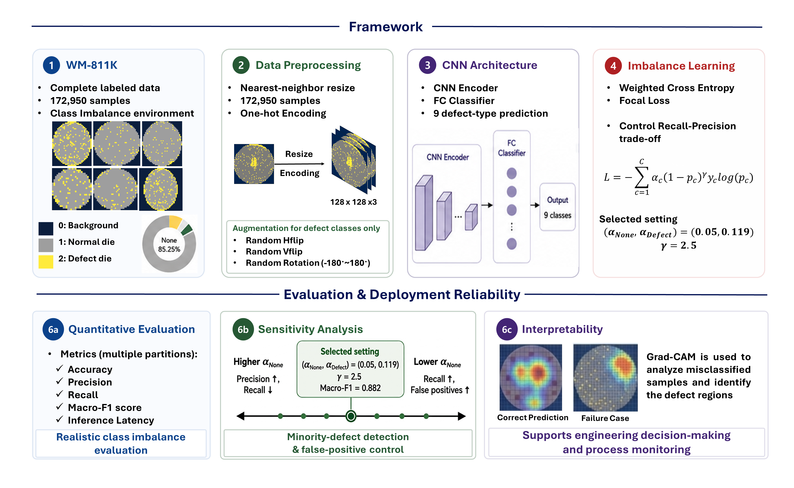

# Robust Process Diagnosis using Explainable CNNs for Highly Imbalanced Wafer Map Defect Classification in Semiconductor Manufacturing

## Purpose
This repository implements a **CNN-based wafer bin map defect classification framework** for realistic semiconductor manufacturing data with severe class imbalance.

The project is based on the full labeled **WM-811K dataset (172,950 samples)** and keeps the dominant `None` class in validation and test sets to evaluate performance under production-like class distributions.


## Workflow

<p align="center">
  
  <br/>
  <em>Overall workflow of the CNN-based wafer defect classification framework.</em>
</p>


## Contributions

- **Deployment-oriented evaluation**: Uses all 172,950 labeled WM-811K samples, including the dominant `None` class, while preserving the original validation and test class distributions.
- **Imbalance-aware learning**: Combines minority-class geometric augmentation with class-weighted focal loss to reduce majority-class bias and improve difficult defect recognition.
- **Robust performance analysis**: Evaluates sensitivity, ablation, and stability across 30 independent stratified data splits, focusing on minority-defect sensitivity and false-positive control.
- **Explainable process diagnosis**: Uses t-SNE and Grad-CAM to analyze learned feature separation and decision-relevant wafer regions, including representative misclassification cases.

## Key Results

- **Classification performance**: Accuracy `0.976 +/- 0.002`, Macro-F1 `0.882 +/- 0.009`
- **Scratch recall improvement**: `0.388` to `0.725` compared with the baseline
- **Inference latency**: `0.225 ms/sample` at batch size 512 on an NVIDIA RTX 4080 16GB GPU
- **Classes**: 9  
  (`Center`, `Donut`, `Edge-Loc`, `Edge-Ring`, `Loc`, `Random`, `Scratch`, `Near-Full`, `None`)

---

## Directory Structure

After downloading the WM-811K dataset, organize the project as follows:

```text
project/
  checkpoints/
    cnn_multi_class_best.pt
  data/
    WM-811K-labeled-dataset.pkl
  figures/
    workflow.png
  model/
    model.py
  utils/
    dataset.py
    loss.py
    trainer.py
    utils.py
  inference_latancy.py
  main.py
  README.md
```

### Notes

- Place the raw or preprocessed WM-811K labeled `.pkl` file inside the `data/` directory.
- Model checkpoints are saved in the `checkpoints/` directory.
- The full labeled dataset contains 172,950 samples across nine classes.
